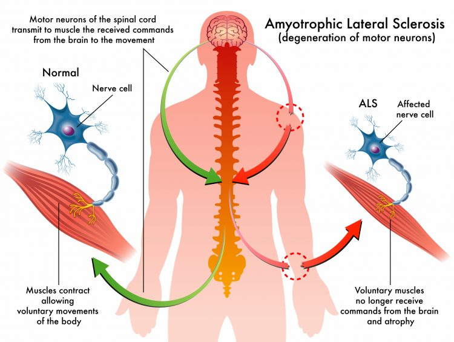

# ProMALS : Advanced Proteomic Profiling for Precision Biomarkers in ALS Prognosis and Disease Progression

### Abstract

Amyotrophic lateral sclerosis (ALS), is a progressive neurodegenerative disorder characterised by the death of motor neurons in the brain and spinal cord. This cell death leads to a gradual loss of muscle control, and usually results in death by respiratory failure within three to five year on average from symptoms onset.The Interest in biomarkers relevant to ALS has grown steadily over the past decade1. Proteomics methods based on mass spectrometry hold special promise for the discovery of novel biomarkers that might form the foundation for new clinical blood tests, but to date, they are disappointing. This is due in part to the lack of a coherent pipeline connecting marker discovery with well-established methods for validation.  
    Indeed, Better diagnostic markers for ALS are urgently needed to improve diagnosis, guide molecularly targeted therapy and monitor activity and therapeutic16, guide molecularly targeted therapy and monitor activity and therapeutic response across a wide spectrum of disease, in our case, ALS. ProMALS is developed to understand ALS through the discovery of precision protein biomarkers. This project utilizes mass spectrometry technology to identify and validate protein biomarkers from patients serum that can predict the progression of ALS and aid in prognosis, offering new possibilities for personalized therapeutic strategies.


### Aims

1.Developing candidate biomarkers from human liquid biopsies for ALS progression, based on unbiased proteomic profiling.

Hypothesis: Pathology relevant proteins can be found and analyzed in ALS patients sera as biomarkers for patients survival.

### Discovery 
I plan on exploring the relationship of proteins to patients survival with linear model named [Cox regression](https://www.ncbi.nlm.nih.gov/pmc/articles/PMC8651375/) this model allows us to assess the importance of each protein in predicting a patient’s survival probability, from which we can extract those that are most relevant to our outcomes.

### Data procesing (processing.py)
- 2929 proteins were annotated based on [Human Proteome And uniprot database](https://www.uniprot.org/proteomes/UP000005640) across 179 ALS patients.
- all the functions of the processing steps stored in a utils.py file  and all the lists and directories stored in configs.py file.

```sh
utils.py
configs.py 
```
1. Use the following command to install the required dependencies:

```sh
pip install -r requirements.txt
```
2. Prepare the data : **def load_raw_proteomics_data(),  def rename_columns(), def drop_protein()**
3. Describe the data: **def describe_proteins_and_samples()**:
4. N1 normalization and log2 transformation : **def norm_and_log(df)**
5. The processing steps is in Jopiter notebook : **def procesing_data.ipynb**


### Feature selection : Univariate Cox regresssion (cox.ipynb)
This approach allows systematic evaluation of each protein's impact on survival, helping to pinpoint candidates for deeper biological or clinical investigation.
- Select proteins based on their statistical significance and effect size (hazard ratio), focusing on those possible greater correlation to patients’ survival.
- You can see Informetion about [Cox regresssion](https://www.ncbi.nlm.nih.gov/pmc/articles/PMC8651375/) analysis.
  

### Models (cox.ipynb)
1. Moltivariant Cox regression : linear model that calculates individual survival probability per patient and can estimate the hazard ratio of each protein, a statistic depicting the correlation between a protein’s level and patient’s survival.
2. [Kaplan-Meier estimate](https://www.ncbi.nlm.nih.gov/pmc/articles/PMC3059453/) : a non-parametric statistical method used to estimate the survival probability over time from life-time data. It generates a survival curve that visualizes the probability of an event (In this case death) occurring at various time points, allowing for comparison between different groups.

### Outcome Analysis:
In my application of these three methods, I aim to identify key features that influence the progression of ALS disease. The predictors (features) include protein abundance as well as clinical features such as sex,patients progressive state as measured by  deltaFRS, and disease format (bulbar or limb). Survival time serves as the target variable.


### Tests the program:

To run the program, use the following command in your terminal:

```sh
test_prepare_data_model.py
```

### Run Tests with pytest

To run the tests, use the following command in your terminal:

```sh
pytest
```


This project was implemented as part of the [Python programming course](https://github.com/szabgab/wis-python-course-2024-04) at the [Weizmann Institute of Science](https://www.weizmann.ac.il/) taught by [Gabor Szabo](https://szabgab.com/)

